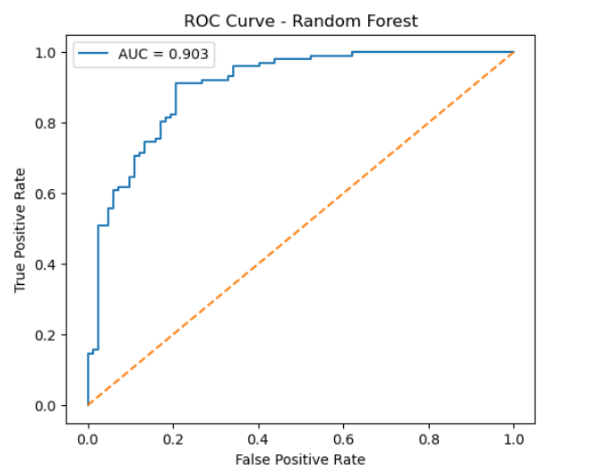
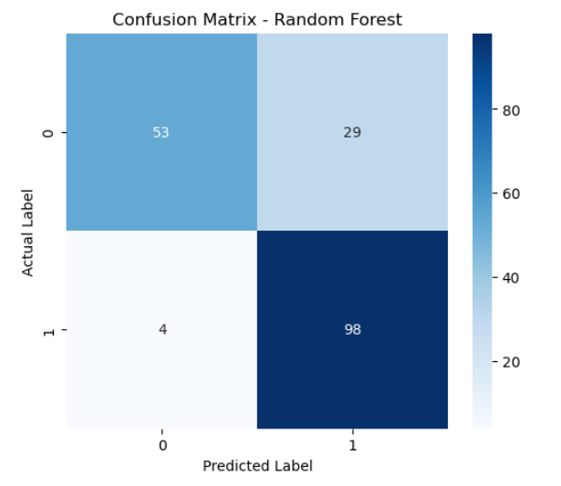

# CardioRisk AI - Heart Disease Risk Prediction using Machine Learning

This project predicts the likelihood of heart disease using machine learning techniques on structured clinical patient data.  
Multiple classification models were implemented and compared, with Random Forest selected as the final model based on recall-focused optimization.

## Dataset

- UCI Heart Disease Dataset (Combined from Cleveland, Hungary, Switzerland, VA)
- ~920 cleaned patient records after preprocessing
- Target:
  - `0` = No Heart Disease
  - `1` = Heart Disease
- Duplicates and missing values removed to prevent overfitting

## Feature Description

The dataset contains 13 clinical attributes commonly used in cardiovascular diagnosis:

- **Age** — Age of the patient (years)
- **Sex** — Gender (1 = Male, 0 = Female)
- **ChestPainType (cp)** — Type of chest pain (4 categories)
- **RestingBP (trestbps)** — Resting blood pressure (mm Hg)
- **Cholesterol (chol)** — Serum cholesterol level (mg/dl)
- **FastingBS (fbs)** — Fasting blood sugar > 120 mg/dl (1 = True, 0 = False)
- **RestingECG (restecg)** — Resting electrocardiographic results
- **MaxHR (thalach)** — Maximum heart rate achieved
- **ExerciseAngina (exang)** — Exercise-induced angina (1 = Yes, 0 = No)
- **Oldpeak (oldpeak)** — ST depression induced by exercise
- **ST_Slope (slope)** — Slope of peak exercise ST segment
- **NumMajorVessels (ca)** — Number of major vessels colored by fluoroscopy
- **Thalassemia (thal)** — Thalassemia status (3 = Normal, 6 = Fixed Defect, 7 = Reversible Defect)

**Target Variable:**
- **HeartDisease (target)** — Presence of heart disease (1 = Disease, 0 = No Disease)

## Models
- Logistic Regression
- Random Forest (Final Selected Model)
- Support Vector Machine (SVM)
- K-Nearest Neighbors (KNN)

## Results

All models were evaluated using accuracy, precision, recall, and F1 score.  
A decision threshold of **0.4** was used for Random Forest to reduce false negatives and improve sensitivity.

| Model | Test Accuracy | Precision | Recall | F1 Score |
|------|--------------|----------|--------|---------|
| Logistic Regression | 0.804 | 0.800 | 0.863 | 0.830 |
| Random Forest | **0.821** | 0.772 | **0.961** | **0.856** |
| SVM | 0.755 | 0.800 | 0.745 | 0.772 |
| KNN | 0.674 | 0.691 | 0.745 | 0.717 |

**Random Forest** was selected as the final model due to its high recall (96.1%), which minimizes false negatives - a critical factor in medical risk estimation.

## Model Performance Visualization

### ROC Curve (Random Forest)

The ROC curve demonstrates strong class separation with an AUC score of **0.903**, indicating good discriminative capability.



### Confusion Matrix (Random Forest)

The confusion matrix confirms strong sensitivity with only **4 false negatives**, ensuring most heart disease cases are correctly identified.



## Technologies
- Python
- NumPy, Pandas
- Matplotlib, Seaborn
- Scikit-learn
- Plotly
- Streamlit

## How to Run

### 1. Clone the Repository
```bash
git clone https://github.com/aryan-pandey00/cardiorisk-ai.git
cd cardiorisk-ai
```
### 2. Install Dependencies
```bash
pip install -r requirements.txt
```
### 3. Run the Application
```bash
streamlit run app.py
```

